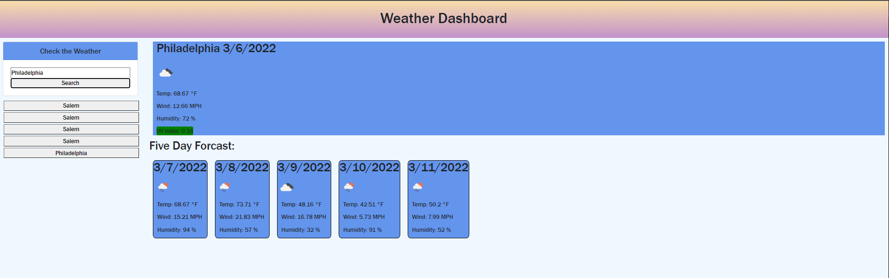

# Weather-Dashboard

[Live Weather Dashboard](https://jsnyder159.github.io/Weather-Dashboard/)

## Description

I built a weather app that allows you to search for citys weather. It will provide that cities name, current date, an icon for the weather, the current temp, wind, humidity %, and a UV index that will also color itself on how severe it is.  It will also give you a five day forcast with a weather Icon, its projected temperature, wind speed, and humidity for those days.  You will be able to access previously searched cities by clicking on their name and bring up that cities information.  Local storage is used for previous cities searched, and Openweather API was used for weather information.

## Languages Used
- HTML
- CSS
- JavaScript
- Bootstrap

